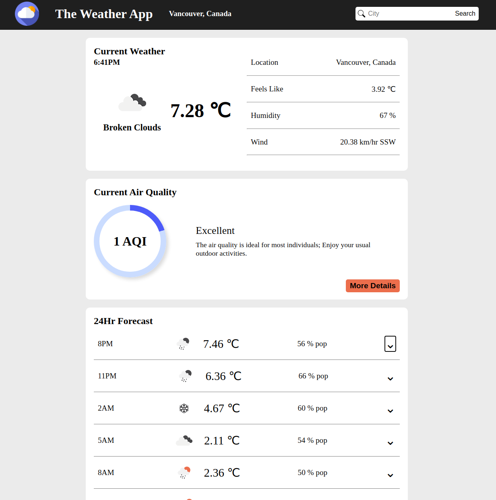

# Weather App

## About

A weather forecast site as part of The ODIN Project curriculum. Utilized the open weather API to gather data for the searched city and display on the page.

## Topics Covered

-   Utilizing APIs and fetch
-   Promises
-   Async function and await

## TODO

-   Refactor weather objects
-   Add functionality to convert units
-   Add weather map
-   Add daily forecast
-   Add location autocomplete (Possibly Google Place Autocomplete)
