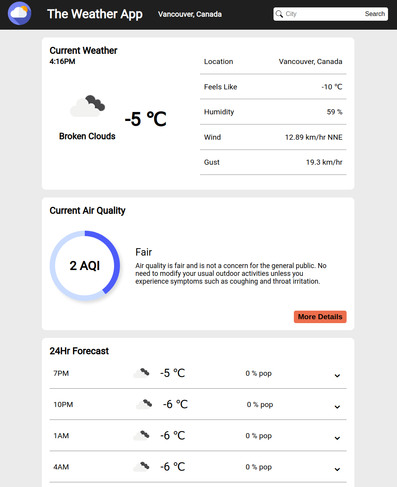

# Weather App

Check it out <a href="https://pbrebner.github.io/weather-app/">Live</a>

## About

A weather forecast site developed as part of The ODIN Project javascript curriculum. Utilizes the open weather API to gather data for a searched city and displays the relevant data on the page with a clean user interface.

## Features

-   Display's current weather, air quality, and 24hr forecast for a specified city on a clean user interface.
-   Utilizing APIs and fetch to gather relevent data.
-   Autocomplete search functionality.

## Technologies Used

-   Javascript
-   APIs (OpenWeather)
-   Webpack
-   HTML/CSS

## TODO

-   Add functionality to convert units
